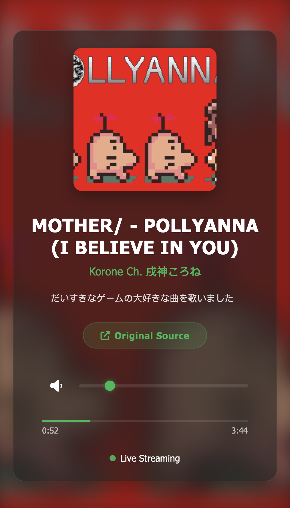
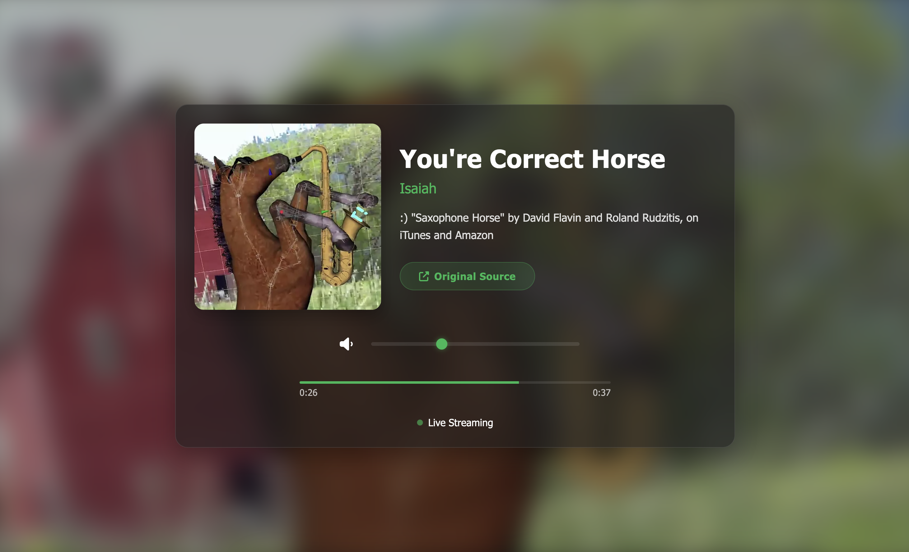

# Live Radio Web App 📻

A minimalist web application that simulates a live radio broadcast, using no actual broadcast source. It plays a set playlist of songs with an always moving current position — just like an internet radio station. This way "time passes" even if the application does not run, and synchronizes playback across browsers and devices. 

Built using vanilla HTML, CSS, and JavaScript. Deployable on any static server or lightweight container like Apache in Docker.

---

## 🚀 Features

- Synchronized playback across devices and browsers, just like if it was live
- Lightweight and fully static (no backend deployment needed!)
- Smooth track transitions with blurred background fade
- Controls for volume + animated progress indicators
- JSON-based playlist (includes metadata generation tool, see below)

## 📸 Screenshots

   
  

## 🧪 Run Locally

Run or deploy with any web server, or simply open the index.html file with your browser of choice. 

---

## ⚙️ Youtube Metadata Generation Tool

This tool extracts structured metadata from any YouTube video and returns it in JSON format, ready to be added to the radio app's playlist.

- Extracts video title, uploader, description, duration, and thumbnail
- Downloads and converts the audio to MP3
- Returns a full metadata object including a playable audio file path

**Usage:**
1. Install prerequisites `brew install yt-dlp ffmpeg`
2. Run the script: `node generate-metadata.js "https://www.youtube.com/watch?v=VIDEO_ID"`

---

This demo includes publically available tracks used for demo purposes:
- 🎵 [“Cat Saying Huh!” – MemeHub](https://www.youtube.com/watch?v=xVWeRnStdSA)
- 🎵 [“MOTHER/ - POLLYANNA (I BELIEVE IN YOU)” – Korone Ch. 戌神ころね](https://www.youtube.com/watch?v=Za9BWNQaJYI)
- 🎵 [“You're Correct Horse” – Isaiah](https://www.youtube.com/watch?v=b3_lVSrPB6w)

Support the original creators by visiting their channels and listening through official platforms.

**MIT License means this code is free to use and modify.** Though, please credit if you borrow significantly.
